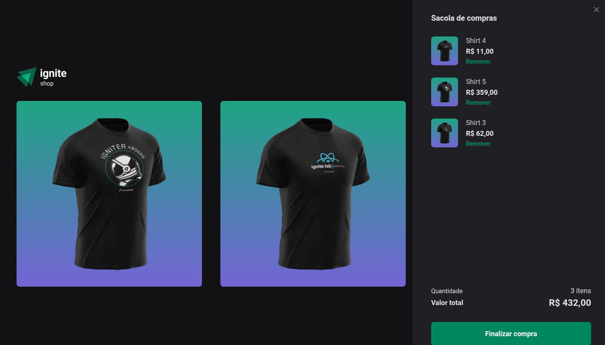

<h1 align="center">
  Ignite Shop
</h1>

  <a href="#-tecnologias">Tecnologias</a>&nbsp;&nbsp;&nbsp;|&nbsp;&nbsp;&nbsp;
  <a href="#-projeto">Projeto</a>&nbsp;&nbsp;&nbsp;|&nbsp;&nbsp;&nbsp;
  <a href="#-layout">Layout</a>&nbsp;&nbsp;&nbsp;|&nbsp;&nbsp;&nbsp;
  <a href="#memo-licenca">Licença</a>

  

## 🚀 Tecnologias

Esse projeto foi desenvolvido com as seguintes tecnologias:

- [React](https://react.dev/)
- [Next.js](https://nextjs.org/)
- [TypeScript](https://www.typescriptlang.org/)
- [Stitches](https://stitches.dev/)
- [Stripe API](https://stripe.com/docs/api)

## 💻 Projeto

O Ignite Shop é uma aplicação de e-commerce desenvolvida durante o bootcamp Ignite da Rocketseat. O objetivo é simular uma loja virtual, permitindo a visualização de produtos, adição ao carrinho e checkout integrado com o Stripe.

## 🔖 Layout

O layout foi baseado no desafio do Ignite da Rocketseat. Você pode conferir o layout no Figma através [deste link](https://www.figma.com/file/7Vu9DzUaCZIV4nibzkjgB4/dev.finance%24-Maratona-Discover), adaptado para o contexto do Ignite Shop.

## :memo: Licença

Este projeto está sob licença MIT. Veja o arquivo [LICENSE](LICENSE) para mais detalhes.

---

### Autor

<a href="https://github.com/cleysonsilvame/" title="Cleyson Silva">
 
  
<b>Cleyson Silva</b> 🚀</a>

 
